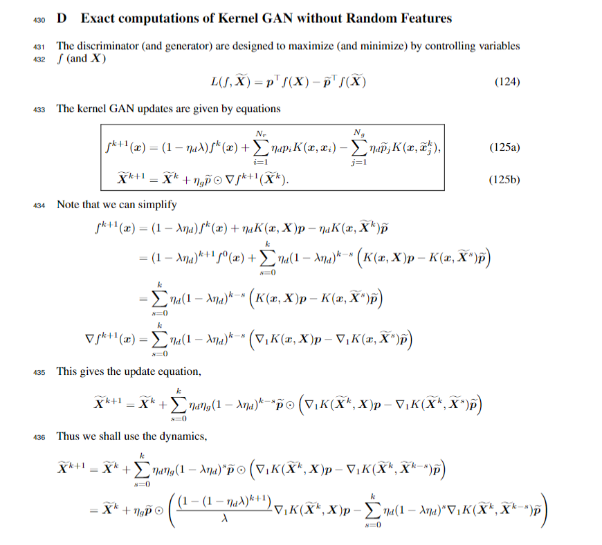

# Kernel GAN dynamics using exact kernels
### Directory Structure: 
```python
.
├── README.md
├── distributions.py
├── utils.py
├── experiments
|   ├── mnist.ipynb* # fitting MNIST data
|   ├── two_point_hyperparams.ipynb* # fitting one target compared to approx. dynamics
|   ├── two_point_dimensions.ipynb* # fitting one target in N-d
|   ├── two_point_multiscale.ipynb* # fitting one target via multi-scale kernel discriminator
|   ├── variance_hyperparams.ipynb* # variance evolution for gaussian init. generated points
|   ├── variance_multiscale* # variance evolutions under multi-scale kernel discriminator
├── kernelgan
|   ├── kernelGAN.py # main module containing GAN, generator, and discriminator classes
|   ├── kernels.py # fast implementation of torch distance and kernel functions
|   ├── ntk.py # implementation of neural tangent kernel

```
### Derivation of Update Rules:



