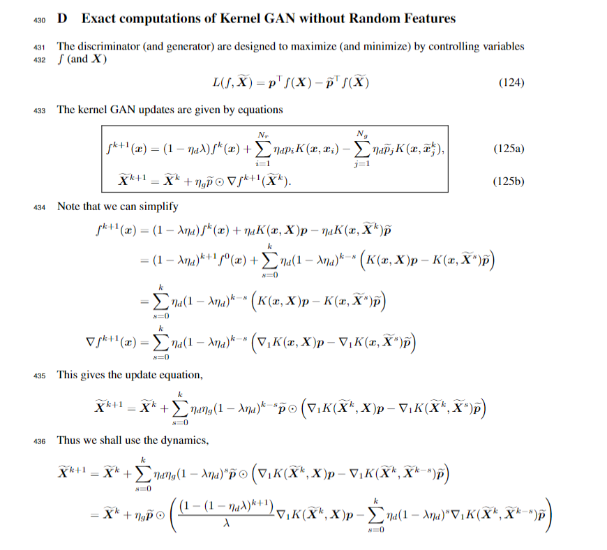

# Kernel GAN dynamics using exact kernels
### Directory Structure:
Note: notebooks marked with \* generate paper figures
```python
.
|## Main files
|--kernelGAN.py # main model class
|--kernels.py # most kernel discriminator classes
|--ntk.py # ntk kernel specifically
|## Playground (not used in papers)
|--multiscale_sandbox.ipynb 
|--ntk_sandbox.ipynb # neural tangent kernel
|--RQ_sandbox.ipynb # rational quadratic kernel
|--RFM_sandbox.ipynb # recursive feature machine (Radakrishnan et al. 2022)
|## Experiments
|--ring.ipynb  # fitting ring of gaussians
|--mnist.ipynb* # fitting MNIST data
|--two_point_dimensions.ipynb* # fitting one target in N-d
|--two_point_ODE.ipynb* # fitting one target compared to approx. dynamics
|--variance_ODE.ipynb* # variance evolution for gaussian init. generated points
|--variance_multiscale* # variance evolutions under different kernels
|--variance_resample # generated points are now resampled at each step
|--worst_case.ipynb # pathological initialization in 1d settings
```
### Derivation of Update Rules:



